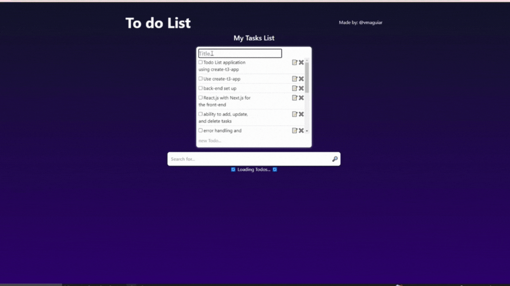
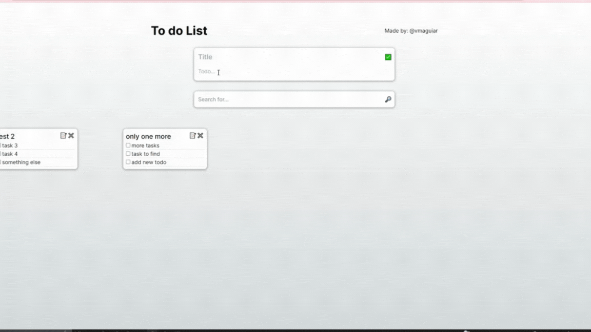

<h3 style="display: block" align = "center"> By vmaguiar </ h3>

# Qavi TypeScript Developer Test

It is a TypeScript Developer Test for Qavi company, that is designed to evaluate your skills in developing a simple todo application. <br>

You have three options to choose from: front-end only, full stack TypeScript (technology of choice), and full stack with create-t3-app

## This branch is my resolution for the FullStack with T3 stack choice

<p align='center'>
  <br>

### The Front-End only resolution is on front-end-only-branch

<p align='center'>
  <br>

## React + Next.js: Front-End only Todo List.

- [✔️] Persisting Data in Application State
- [✔️] Implement a front-end Todo List application using TypeScript and Next.js.
- [✔️] Use React.js with Next.js for the front-end development.
- [✔️] Display a list of tasks with the ability to add, update, and delete tasks.
- [✔️] Include proper error handling and validation.
- [✔️] Add a search/filter feature to search for specific tasks.
- [✔️] Implement a user-friendly UI with appropriate styling.
- [✔️] Utilize state management (e.g., React hooks) to persist data within the application.
- [ - ] Employ Next.js routing for smooth navigation. <br>

### Additional features:

* [✔️] Card feature with title and todo's (like google keep list).
* [✔️] display all the cards created.
* [✔️] Detailed README.md

<br>

## FullStack TypeScript: Front-End and Back-End (Tecnology of your choice) Todo List.

- [] Implement a full-stack Todo List application using TypeScript.
- [] Choose your preferred technology stack for the back-end (e.g., Node.js with Express, NestJS, Next, etc.).
- [] Use React.js with Next.js for the front-end development.
- [] Display a list of tasks with the ability to add, update, and delete tasks.
- [] Include proper error handling and validation.
- [] Add a search/filter feature to search for specific tasks.
- [] Implement a user-friendly UI with appropriate styling.
- [] Design a RESTful API for CRUD operations on the back-end.
- [] Connect the front-end application to the back-end using appropriate API calls.
- [] Handle data synchronization between the client and server. <br>


## FullStack with T3 Stack: Use create-t3-app for bootstrap your Todo List app.

- [✔️] Implement a full-stack Todo List application using create-t3-app.
- [✔️] Use create-t3-app (https://create.t3.gg/) to bootstrap your project.
- [✔️] The back-end will be automatically set up using the create-t3-app stack.
- [✔️] Use React.js with Next.js for the front-end development.
- [✔️] Display a list of tasks with the ability to add, update, and delete tasks
- [✔️] Include proper error handling and validation.
- [✔️] Add a search/filter feature to search for specific tasks.
- [✔️] Implement a user-friendly UI with appropriate styling.
- [✔️] Design a RESTful API for CRUD operations on the back-end.
- [✔️] Handle data synchronization between the client and server.

### Additional features:

* [-] Card feature with title and todo's (like google keep list).
* [-] display all the cards created.
* [✔️] Detailed README.md


#### to get things worked:

### Clone this repository:

```bash 
git clone https://github.com/vmaguiar/qavi-todo-list-app.git
```
or if you want only the front-end resolution <br>
clone the single branch:

```bash 
git clone -b front-end-only-branch --single-branch https://github.com/vmaguiar/qavi-todo-list-app.git
```
then open the folder:
```bash 
cd qavi-todo-list-app
```

if you clone the repository go to the branch you want to: <br>
- the main branch:
```bash 
git checkout main
```
- the t3 branch:
```bash 
git checkout t3-branch
```
- the react + next.js branch:
```bash 
git checkout front-end-only-branch
```
<br>

### download all dependences used by the app:

```bash 
npm ci
```

### Run the development project:

```bash 
npm run dev
```

## ⚒️  tools used:

</div>


 <div style="display: inline_block" align = "center"><br>

  
  
  
  
  
  
  
  
  
  
  
            
</div>
