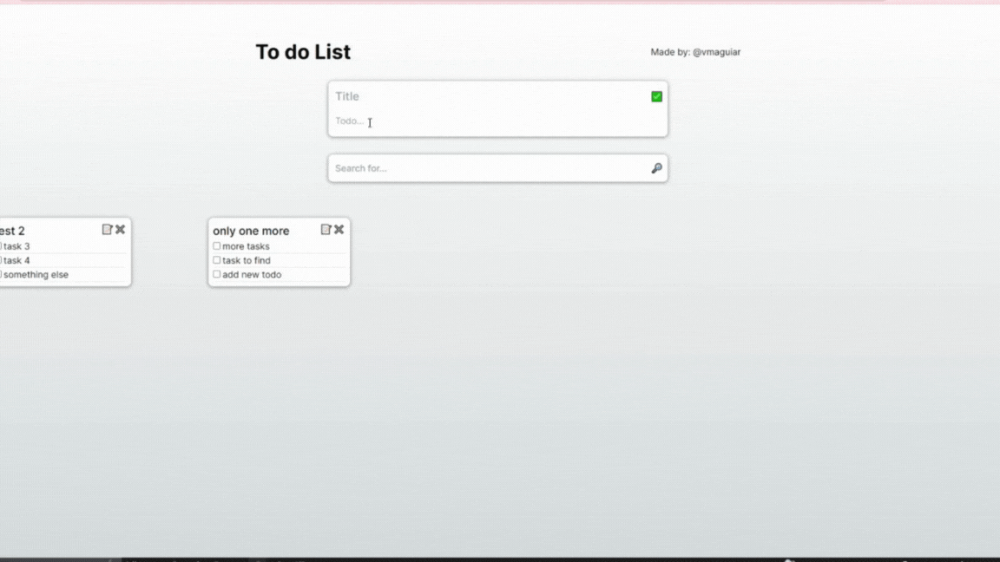

<h3 style="display: block" align = "center"> By vmaguiar </ h3>

# Qavi TypeScript Developer Test

This is a TypeScript Developer Test for Qavi company, that is designed to evaluate your skills in developing a simple todo application. <br>

You have three options to choose from: front-end only, full stack TypeScript (technology of choice), and full stack with create-t3-app

## This branch is a resolution for the front-end only choice

<p align='center'>
  <br>

## React + Next.js: Front-End only Todo List.

- [✔️] Persisting Data in Application State
- [✔️] Implement a front-end Todo List application using TypeScript and Next.js.
- [✔️] Use React.js with Next.js for the front-end development.
- [✔️] Display a list of tasks with the ability to add, update, and delete tasks.
- [✔️] Include proper error handling and validation.
- [✔️] Add a search/filter feature to search for specific tasks.
- [✔️] Implement a user-friendly UI with appropriate styling.
- [✔️] Utilize state management (e.g., React hooks) to persist data within the application.
- [ - ] Employ Next.js routing for smooth navigation. <br>


### Additional features:

* [✔️] Card feature with title and todo's (like google keep list).
* [✔️] display all the cards created.
* [✔️] Detailed README.md

<br>

#### to get things worked:

### Clone this repository:

```bash 
git clone https://github.com/vmaguiar/qavi-todo-list-app.git
```

### Open the folder and vscode (or yours code editor):

```bash 
cd qavi-todo-list-app
code .
```

### Go to the right branch, on this case "front-end-only-branch":

```bash 
git checkout front-end-only-branch
```

### Download all dependences used by the app:

```bash 
npm ci
```
or

```bash
npm install
```

### Run the development project:

```bash 
npm run dev
```

## ⚒️  tools used:

</div>


 <div style="display: inline_block" align = "center"><br>

  
  
  
  
  
  
  
  
            
</div>

